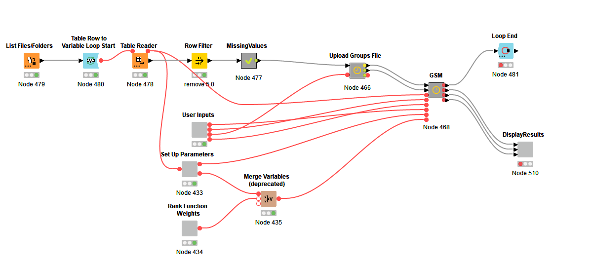
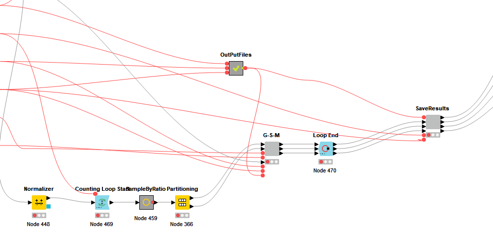
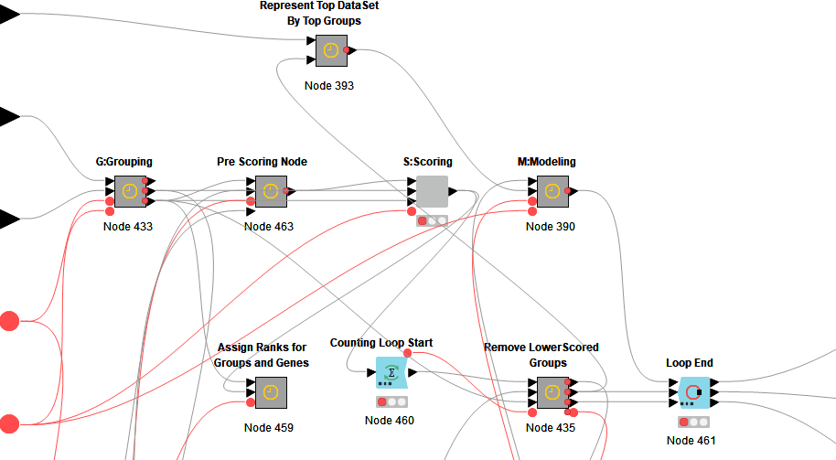
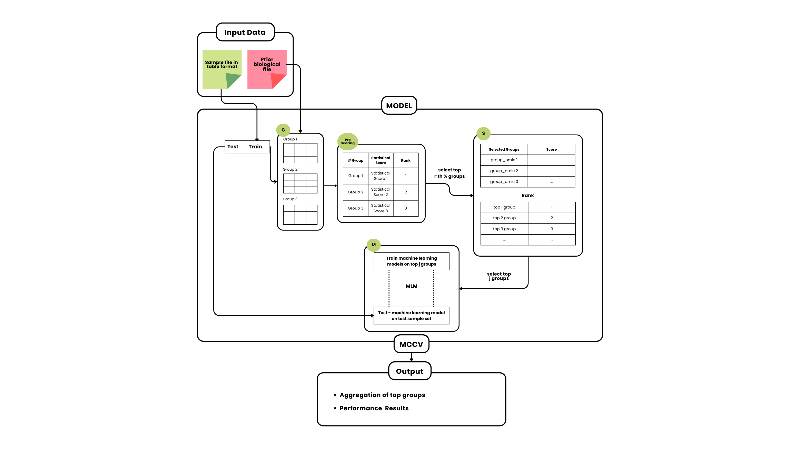

# **Pre-Scoring G-S-M: Enhancing the Grouping-Scoring-Modeling Framework for Transcriptomic Data Analysis**

## **Authors**

Maham Khokhar1, Burcu Bakir-Gungor2, and Malik Yousef3 
1 Department of Data Science, Abdullah Gul University, Kayseri, Turkey
2 Department of Computer Engineering,, Abdullah Gul University, Kayseri, Turkey
3 Department of Information Systems, Galilee Digital Health Research Center, Zefat Academic College, Israel

**Correspondence:** [mahamkhokar96@gmail.com](mailto:mahamkhokar96@gmail.com)

**Correspondence**: [malik.yousef@gmail.com](mailto:malik.yousef@gmail.com);

Link to the paper : 
[https://www.scitepress.org/Link.aspx?doi=10.5220/0013192600003911](https://www.scitepress.org/Link.aspx?doi=10.5220/0013192600003911) 
DOI: [10.5220/0013192600003911](https://doi.org/10.5220/0013192600003911)

## **KNIME Setup**

Pre Scoring G-S-M is a Knime workflow. In order to run the workflow, you need to download Knime and install it in your local machine. This is the link for downloading Knime: [https://www.knime.com/downloads](https://www.knime.com/downloads) 
For more information about the Knime platform you might visit [https://www.knime.com/software-overview](https://www.knime.com/software-overview) 
See this [page](https://github.com/malikyousef/PriPath/blob/main/pages/SettingsKnime.md) for information about setting Knime. 
Visit this [page](https://github.com/malikyousef/PriPath/blob/main/pages/TableFormat.md) for instruction in how to prepare the dataset into Knime table format (\*.table) using a Knime workflow 
Visit this [page](https://github.com/malikyousef/PriPath/blob/main/pages/GroupingFile.md) for instructions on how to upload the Groups file.

# **Data Preparation**

1. Gene expression datasets for different types of human complex diseases is required to be downloaded from Gene Expression Omnibus ([https://www.ncbi.nlm.nih.gov/geo/](https://www.ncbi.nlm.nih.gov/geo/))

2.  The gene-disease association dataset used in this workflow was obtained from **DisGeNET v7.0**. 
   [https://disgenet.com/](https://disgenet.com/) 
     
   The original dataset contained: 
* **30,170 diseases** 
* **21,666 genes** 
* **3,241,576 gene-disease associations** 
  To optimize computational efficiency and maintain relevance, the following filters were applied: 
1. **Filter by Disease Type:** 
   * Retained only entries categorized as **"Disease"**, excluding "Phenotype" and "Group". 
2. **Filter by Disease Semantic Type:** 
   * Selected diseases classified under **"Neoplastic Process"** and **"Disease"** to focus on biologically significant associations.

After filtering, the dataset was reduced to:

* **15,991 genes** 
* **3,929 diseases** 
* **329,936 gene-disease associations** 
  This refined dataset was then formatted into a **KNIME-compatible table (`*.table`)** for use in the workflow.

Additionally, **DisGeNET** was used as the primary database for prior biological knowledge when experimenting. However, other biological knowledge databases, such as **Gene Ontology (GO)** and **KEGG PATHWAY**, could also be used to define gene groups and associations.

## **Setting Up the Environment**

The Pre Scoring G-S-M workflow contains python and R scripts in it so to avoid any error one need to set up the KNIME Python settings following this path inside KNIME :

* File \-\> Preferences \-\> KNIME(left side of the pop-up) \-\> Python

* And your R server needs to be (open) running simultaneously when the execution starts. To be able to open this please use following commands in your R / RStudio:

  * library(Rserve);

  * Rserve(args \= "--vanilla")     If you set all of these environment settings you'll never encounter any error with this stable version of the workflow.

## **Executing the Pre Scoring G-S-M Workflow**

1. **Configure Data Input**: 
   * Ensure that your dataset is formatted correctly as a KNIME table (`*.table`). 
   * Use the "List Files/Folders" node to point to your dataset folder. 
2. **Set Parameters**: 
   * Adjust the "MCCV Iterations" node for Monte Carlo Cross Validation (e.g., 10 or 100 iterations). 
   * Specify the percentage of top-ranked gene groups to retain for scoring (e.g., top 20%).

## **Pre-Scoring G-S-M MetaNode Overview**

## 

## **The 4 main component of Pre-Scoring G-S-M**

## **Workflow Components**

### **Main Workflow:**

* **Grouping Component (G):** Groups genes based on biological knowledge using databases like DisGeNET and KEGG. 
* **Pre-Scoring Component:** Uses **Limma's empirical Bayes method** to prioritize significant gene groups. 
* **Scoring Component (S):** Evaluates the groups using machine learning models such as **Random Forest**. 
* **Modeling Component (M):** Builds predictive models using top-ranked groups to classify transcriptomic data.

**Final Workflow Diagram**

